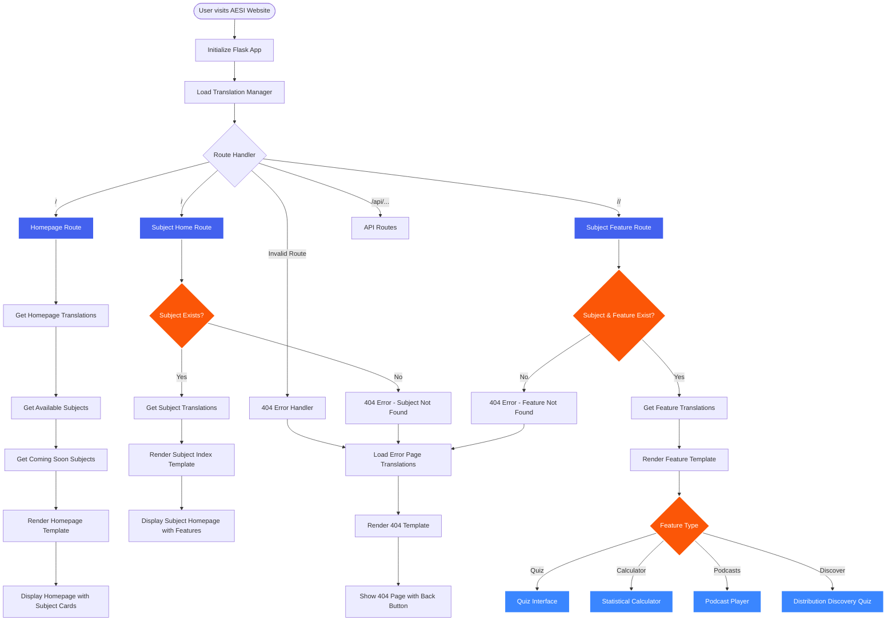

# AESI Website - Main Routing System

## Main Routing System Overview

### Core Functionality
- **Dynamic Route Generation**: Routes are automatically generated based on translation structure
- **Subject Validation**: Checks if requested subjects exist in the translation system
- **Feature Validation**: Validates that requested features are available for the subject
- **Error Handling**: Centralized 404 error handling for all invalid routes

### Route Types
1. **Homepage Route** (`/`): Main landing page with subject overview
2. **Subject Home Route** (`/<subject>`): Individual subject homepage with feature list
3. **Subject Feature Route** (`/<subject>/<feature>`): Specific feature pages (quiz, calculator, etc.)
4. **API Routes** (`/api/...`): RESTful endpoints for data access
