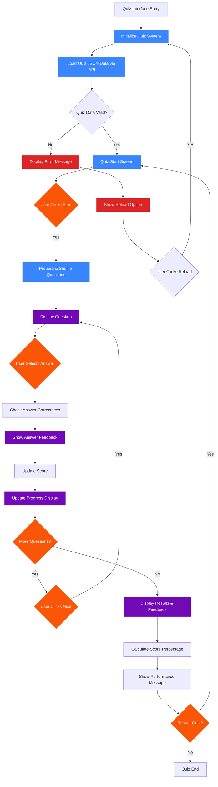

# AESI Website - Quiz System

## Quiz System Features

### Core Components
- **Dynamic Question Loading**: Questions loaded via API calls
- **Question Shuffling**: Random order for each quiz session
- **Real-time Feedback**: Immediate answer validation with explanations
- **Progress Tracking**: Visual progress bar and score display
- **Performance Analysis**: Detailed results with improvement suggestions

### Quiz Types
1. **Standard Quiz**: Multiple choice questions with explanations
2. **Discovery Quiz**: Interactive scenario-based learning for distribution identification
3. **Unified System**: Consolidated quiz engine for all types

### Quiz Files
- `probabilidade_quiz.json`: Probability and statistics questions
- `descobrir_distribuição.json`: Distribution identification scenarios
- `analise_estatistica_quiz.json`: Data analysis questions

### Interactive Elements
- Answer validation with visual feedback
- Smooth scrolling to feedback sections
- Auto-advance options
- Restart functionality
- Error recovery mechanisms
