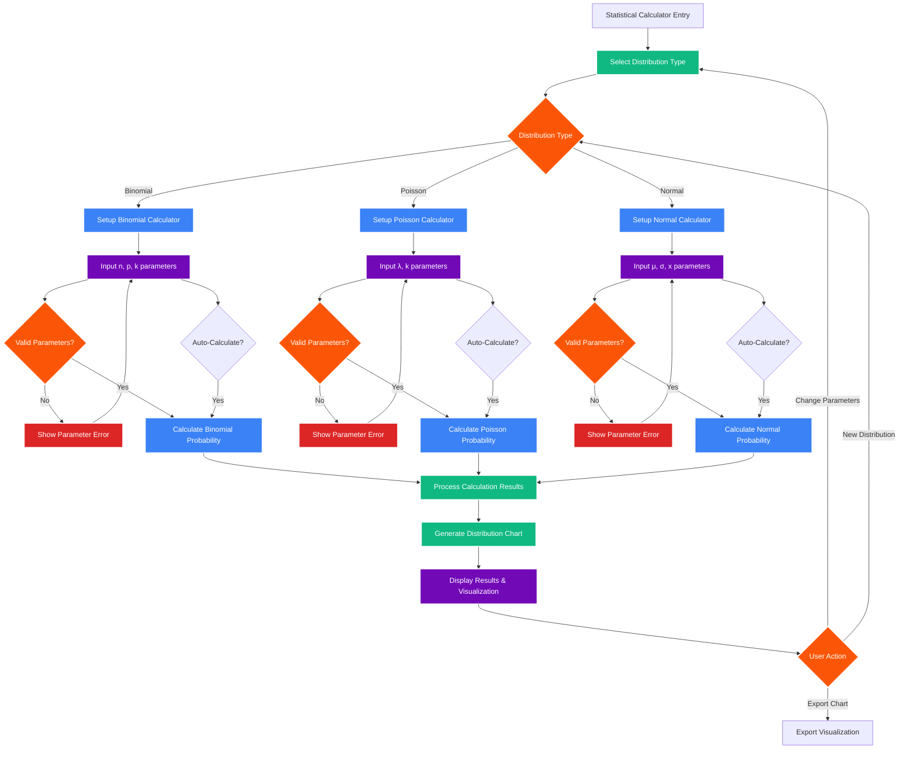

# AESI Website - Statistical Calculator

## Statistical Calculator Features

### Distribution Types
1. **Binomial Distribution**
   - Parameters: n (trials), p (probability), k (successes)
   - Calculates exact probabilities and cumulative distributions
   
2. **Poisson Distribution**
   - Parameters: λ (rate), k (events)
   - Ideal for modeling rare events
   
3. **Normal Distribution**
   - Parameters: μ (mean), σ (standard deviation), x (value)
   - Continuous probability calculations

### Key Features
- **Real-time Calculation**: Auto-calculates as parameters change
- **Interactive Charts**: Visual distribution representations using Chart.js
- **Parameter Validation**: Ensures mathematically valid inputs
- **Export Options**: Save charts and results
- **Educational Context**: Explanations and use cases for each distribution

### Technical Implementation
- Client-side calculations for instant feedback
- Chart.js integration for interactive visualizations
- Responsive design for mobile compatibility
- Translation support for all interface elements
- Auto-calculation features for real-time updates
