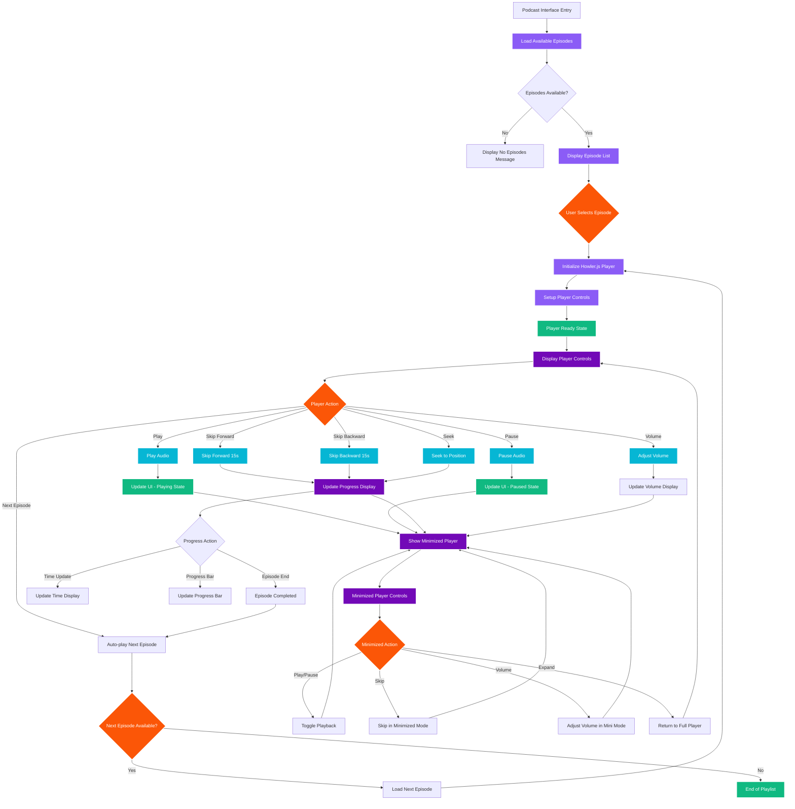

# AESI Website - Podcast System

## Podcast System Features

### Core Functionality
- **Howler.js Integration**: Professional audio playback with cross-browser support
- **Episode Management**: Dynamic loading and organization of educational content
- **Persistent Player**: Minimized player continues across page navigation
- **Auto-play Features**: Seamless episode transitions with playlist support

### Player Controls
1. **Basic Controls**: Play, pause, skip forward/backward (15s increments)
2. **Advanced Controls**: Volume adjustment, seek to position, speed control
3. **Progress Tracking**: Real-time progress bar and time display
4. **Episode Navigation**: Next/previous episode with auto-play

### Educational Content
- **Structured Episodes**: Organized by topic and difficulty
- **Audio Quality**: High-quality educational recordings
- **Accessibility**: Keyboard controls and screen reader support
- **Mobile Optimization**: Touch-friendly controls and responsive design

### Technical Features
- **Background Playback**: Continues playing while browsing other pages
- **State Persistence**: Remembers playback position and settings
- **Error Handling**: Graceful handling of network issues and audio errors
- **Performance**: Optimized loading and minimal resource usage
