# AESI Website - Translation & Global Features

```mermaid
flowchart TD
    %% Translation System
    subgraph TRANSLATION_SYSTEM [Translation Management System]
        TRANS_MANAGER[Translation Manager] --> LOAD_TRANSLATIONS[Load Portuguese Translations]
        LOAD_TRANSLATIONS --> CACHE_TRANSLATIONS[Cache Translation Data]
        CACHE_TRANSLATIONS --> GET_PAGE_TRANS[Get Page-specific Translations]
        GET_PAGE_TRANS --> GET_SUBJECT_DATA[Get Subject Configuration]
    end
    
    %% Theme System
    subgraph THEME_SYSTEM [Theme Management]
        THEME_TOGGLE[Theme Toggle System] --> THEME_TYPE{Theme Type}
        THEME_TYPE -->|Light| GRASS_THEME[Grass Theme - Light Mode]
        THEME_TYPE -->|Dark| GALAXY_THEME[Galaxy Theme - Dark Mode]
        GRASS_THEME --> SAVE_THEME[Save Theme Preference]
        GALAXY_THEME --> SAVE_THEME
        SAVE_THEME --> UPDATE_CSS[Update CSS Variables]
        UPDATE_CSS --> APPLY_THEME[Apply Theme to Elements]
    end
    
    %% Mobile Navigation
    subgraph MOBILE_NAV_SYSTEM [Mobile Navigation]
        MOBILE_NAV[Mobile Navigation] --> HAMBURGER_MENU[Hamburger Menu Toggle]
        HAMBURGER_MENU --> MOBILE_MENU_STATE{Menu State}
        MOBILE_MENU_STATE -->|Open| SHOW_MOBILE_MENU[Show Mobile Menu]
        MOBILE_MENU_STATE -->|Close| HIDE_MOBILE_MENU[Hide Mobile Menu]
        SHOW_MOBILE_MENU --> MOBILE_INTERACTIONS[Mobile Menu Interactions]
        MOBILE_INTERACTIONS --> MOBILE_NAVIGATION[Navigate to Selected Page]
        MOBILE_INTERACTIONS --> CLEAN_NAVIGATION[Clean Navigation - No Redundant Home Buttons]
    end
    
    %% Background Animation System
    subgraph BACKGROUND_SYSTEM [Background Animations]
        BACKGROUND_ANIM[Background Animation Controller] --> BG_TYPE{Background Type}
        BG_TYPE -->|Light Mode| GRASS_PARTICLES[Grass Particles Animation]
        BG_TYPE -->|Dark Mode| STARFIELD[Galaxy Starfield Animation]
        GRASS_PARTICLES --> PARTICLE_PHYSICS[Particle Physics Engine]
        STARFIELD --> STAR_GENERATION[Star Generation & Movement]
    end
    
    %% API System
    subgraph API_SYSTEM [API Management]
        API_ROUTES[API Routes Handler] --> API_TYPE{API Type}
        API_TYPE -->|"/api/quiz/<subject>"| GET_QUIZ_API[Get Quiz Data]
        API_TYPE -->|"/api/quizzes"| GET_QUIZZES_API[Get All Quizzes List]
        
        GET_QUIZ_API --> LOAD_QUIZ_JSON[Load Quiz JSON File]
        GET_QUIZZES_API --> SCAN_QUIZ_FILES[Scan Quiz Directory]
        LOAD_QUIZ_JSON --> RETURN_QUIZ_DATA[Return Quiz JSON]
        SCAN_QUIZ_FILES --> RETURN_QUIZ_LIST[Return Quiz List JSON]
    end
    
    %% Global State Management
    subgraph STATE_MANAGEMENT [Global State Management]
        NAVIGATION_HELPER[Navigation State Management] --> TRACK_CURRENT_PAGE[Track Current Page]
        TRACK_CURRENT_PAGE --> UPDATE_NAV_STATE[Update Navigation State]
        UPDATE_NAV_STATE --> BREADCRUMB_UPDATE[Update Breadcrumbs]
        
        PERSISTENT_PLAYER[Persistent Audio Player] --> PLAYER_STATE[Maintain Player State]
        PLAYER_STATE --> CROSS_PAGE_PLAYBACK[Cross-page Playback]
    end
    
    %% Inter-system Connections
    TRANS_MANAGER -.-> THEME_TOGGLE
    TRANS_MANAGER -.-> MOBILE_NAV
    TRANS_MANAGER -.-> API_ROUTES
    
    THEME_TYPE -.-> BACKGROUND_ANIM
    SAVE_THEME -.-> PARTICLE_PHYSICS
    SAVE_THEME -.-> STAR_GENERATION
    
    %% Styling
    classDef translation fill:#22c55e,stroke:#fff,stroke-width:2px,color:#fff
    classDef theme fill:#3b82f6,stroke:#fff,stroke-width:2px,color:#fff
    classDef mobile fill:#f59e0b,stroke:#fff,stroke-width:2px,color:#fff
    classDef background fill:#8b5cf6,stroke:#fff,stroke-width:2px,color:#fff
    classDef api fill:#f72585,stroke:#fff,stroke-width:2px,color:#fff
    classDef state fill:#06b6d4,stroke:#fff,stroke-width:2px,color:#fff
    classDef decision fill:#fb5607,stroke:#fff,stroke-width:2px,color:#fff
    
    class TRANS_MANAGER,LOAD_TRANSLATIONS,CACHE_TRANSLATIONS,GET_PAGE_TRANS translation
    class THEME_TOGGLE,GRASS_THEME,GALAXY_THEME,SAVE_THEME,UPDATE_CSS theme
    class MOBILE_NAV,HAMBURGER_MENU,SHOW_MOBILE_MENU,HIDE_MOBILE_MENU mobile
    class BACKGROUND_ANIM,GRASS_PARTICLES,STARFIELD,PARTICLE_PHYSICS background
    class API_ROUTES,GET_QUIZ_API,GET_QUIZZES_API,RETURN_QUIZ_DATA api
    class NAVIGATION_HELPER,PERSISTENT_PLAYER,PLAYER_STATE,CROSS_PAGE_PLAYBACK state
    class THEME_TYPE,MOBILE_MENU_STATE,BG_TYPE,API_TYPE decision
```

## Global Features Overview

### Translation System
- **Dynamic Content Loading**: All text loaded from Portuguese translation files
- **Caching Strategy**: Efficient translation data caching for performance
- **Context-Aware Delivery**: Page and subject-specific translation loading
- **Scalable Architecture**: Easy addition of new languages

### Theme Management
- **Dual Theme Support**: Light (Grass) and Dark (Galaxy) themes
- **Persistent Preferences**: Theme choice saved in localStorage
- **CSS Variable System**: Dynamic theme switching via CSS custom properties
- **Animated Transitions**: Smooth theme change animations

### Mobile Navigation
- **Responsive Design**: Hamburger menu for mobile devices
- **Touch-Friendly**: Optimized for touch interactions
- **Accessibility**: Keyboard navigation and screen reader support
- **State Management**: Proper menu state handling

### Background Animations
- **Theme-Specific**: Different animations for light/dark themes
- **Performance Optimized**: Efficient particle systems and star fields
- **Interactive Elements**: Subtle animations that respond to user interaction
- **Resource Management**: Smart loading and cleanup of animation resources

### API Integration
- **RESTful Endpoints**: Clean API structure for data access
- **JSON-Based**: Standardized data format for all endpoints
- **Error Handling**: Robust error handling and fallback mechanisms
- **Caching Strategy**: Efficient data loading and caching
