# AESI Website - Discovery Quiz System

```mermaid
flowchart TD
    %% Discovery Quiz Entry
    DISCOVER_START_ENTRY[Distribution Discovery Entry] --> INIT_DISCOVER[Initialize Distribution Discovery]
    
    %% Discovery Initialization
    INIT_DISCOVER --> LOAD_DISCOVER_DATA[Load Discovery Scenarios]
    LOAD_DISCOVER_DATA --> DATA_CHECK{Scenarios Available?}
    DATA_CHECK -->|No| DISCOVER_ERROR[Display Error Message]
    DATA_CHECK -->|Yes| DISCOVER_START[Discovery Start Screen]
    
    %% Discovery Flow
    DISCOVER_START --> START_DISCOVERY{User Starts Discovery}
    START_DISCOVERY -->|Yes| PREPARE_SCENARIOS[Prepare Scenario Set]
    PREPARE_SCENARIOS --> SHOW_SCENARIO[Show Real-world Scenario]
    
    %% Scenario Presentation
    SHOW_SCENARIO --> SCENARIO_CONTENT[Display Scenario Description]
    SCENARIO_CONTENT --> DISTRIBUTION_OPTIONS[Show Distribution Options]
    DISTRIBUTION_OPTIONS --> OPTION_DISPLAY[Display Distribution Choices]
    
    %% User Interaction
    OPTION_DISPLAY --> USER_CHOICE{User Selects Distribution}
    USER_CHOICE --> VALIDATE_CHOICE[Validate Choice Against Correct Answer]
    VALIDATE_CHOICE --> CHOICE_FEEDBACK{Choice Correct?}
    
    %% Feedback System
    CHOICE_FEEDBACK -->|Correct| CORRECT_FEEDBACK[Show Correct Explanation]
    CHOICE_FEEDBACK -->|Incorrect| INCORRECT_FEEDBACK[Show Why Incorrect & Correct Answer]
    
    CORRECT_FEEDBACK --> SHOW_EXPLANATION[Show Detailed Explanation]
    INCORRECT_FEEDBACK --> SHOW_EXPLANATION
    
    %% Educational Content
    SHOW_EXPLANATION --> UPDATE_DISCOVER_SCORE[Update Score]
    
    %% Progress Management
    UPDATE_DISCOVER_SCORE --> UPDATE_DISCOVER_PROGRESS[Update Progress Display]
    UPDATE_DISCOVER_PROGRESS --> MORE_SCENARIOS{More Scenarios Available?}
    
    %% Scenario Loop
    MORE_SCENARIOS -->|Yes| NEXT_SCENARIO{Continue to Next?}
    NEXT_SCENARIO -->|Yes| SHOW_SCENARIO
    MORE_SCENARIOS -->|No| DISCOVER_RESULTS[Show Discovery Results]
    
    %% Results and Analysis
    DISCOVER_RESULTS --> CALC_DISCOVER_PERCENTAGE[Calculate Score Percentage]
    CALC_DISCOVER_PERCENTAGE --> DISCOVER_RESTART{Try Again?}
    
    %% Restart Logic
    DISCOVER_RESTART -->|Yes| DISCOVER_START
    DISCOVER_RESTART -->|No| DISCOVER_END[Discovery Complete]
    
    %% Educational Scenarios
    subgraph SCENARIO_TYPES [Scenario Categories]
        BINOMIAL_SCENARIOS[Binomial Scenarios]
        POISSON_SCENARIOS[Poisson Scenarios] 
        NORMAL_SCENARIOS[Normal Scenarios]
    end
    
    PREPARE_SCENARIOS --> SCENARIO_TYPES
    
    %% Error Handling
    DISCOVER_ERROR --> RELOAD_DISCOVER[Show Reload Option]
    RELOAD_DISCOVER --> RELOAD_DISCOVER_BUTTON{User Clicks Reload}
    RELOAD_DISCOVER_BUTTON -->|Yes| INIT_DISCOVER
    
    %% Styling
    classDef discover fill:#10b981,stroke:#fff,stroke-width:2px,color:#fff
    classDef scenario fill:#3b82f6,stroke:#fff,stroke-width:2px,color:#fff
    classDef interactive fill:#7209b7,stroke:#fff,stroke-width:2px,color:#fff
    classDef feedback fill:#f59e0b,stroke:#fff,stroke-width:2px,color:#fff
    classDef decision fill:#fb5607,stroke:#fff,stroke-width:2px,color:#fff
    classDef error fill:#dc2626,stroke:#fff,stroke-width:2px,color:#fff
    
    class INIT_DISCOVER,LOAD_DISCOVER_DATA,PREPARE_SCENARIOS,DISCOVER_START discover
    class SHOW_SCENARIO,SCENARIO_CONTENT,DISTRIBUTION_OPTIONS,OPTION_DISPLAY scenario
    class USER_CHOICE,UPDATE_DISCOVER_PROGRESS,SHOW_STRENGTHS,RECOMMEND_STUDY interactive
    class CORRECT_FEEDBACK,INCORRECT_FEEDBACK,SHOW_EXPLANATION,EXPLAIN_DISTRIBUTION feedback
    class START_DISCOVERY,CHOICE_FEEDBACK,MORE_SCENARIOS,DISCOVER_RESTART decision
    class DISCOVER_ERROR,RELOAD_DISCOVER error
```

## Discovery Quiz System Features

### Educational Approach
- **Real-world Scenarios**: Practical situations that require distribution identification
- **Interactive Learning**: Learn by doing rather than memorizing
- **Contextual Explanations**: Detailed explanations of why each distribution fits
- **Progressive Difficulty**: Scenarios increase in complexity

### Distribution Coverage
1. **Binomial Distribution**: Success/failure scenarios with fixed trials
2. **Poisson Distribution**: Rare events over time or space
3. **Normal Distribution**: Continuous measurements and natural phenomena

### Assessment Features
- **Adaptive Feedback**: Different explanations based on user's choice
- **Performance Analysis**: Identifies strengths and weaknesses by distribution type
- **Study Recommendations**: Personalized suggestions for improvement
- **Progress Tracking**: Visual progress through scenario sets

### Pedagogical Benefits
- **Conceptual Understanding**: Focus on understanding rather than calculation
- **Real-world Application**: Connects theory to practical situations
- **Critical Thinking**: Requires analysis of scenario characteristics
- **Reinforcement Learning**: Immediate feedback strengthens understanding
