# AESI Website Functionality Flowchart

```mermaid
flowchart TD
    %% Entry Points
    START([User visits AESI Website]) --> INIT[Initialize Flask App]
    INIT --> LOAD_TRANS[Load Translation Manager]
    LOAD_TRANS --> ROUTE_HANDLER{Route Handler}
    
    %% Main Routes
    ROUTE_HANDLER -->|"/"| HOME_PAGE[Homepage Route]
    ROUTE_HANDLER -->|"/<subject>"| SUBJECT_HOME[Subject Home Route]
    ROUTE_HANDLER -->|"/<subject>/<feature>"| SUBJECT_FEATURE[Subject Feature Route]
    ROUTE_HANDLER -->|"/api/..."| API_ROUTES[API Routes]
    ROUTE_HANDLER -->|Invalid Route| ERROR_404_MAIN[404 Error Handler]
    
    %% Homepage Flow
    HOME_PAGE --> GET_HOMEPAGE_TRANS[Get Homepage Translations]
    GET_HOMEPAGE_TRANS --> GET_SUBJECTS_LIST[Get Available Subjects]
    GET_SUBJECTS_LIST --> GET_COMING_SOON[Get Coming Soon Subjects]
    GET_COMING_SOON --> RENDER_HOMEPAGE[Render Homepage Template]
    RENDER_HOMEPAGE --> HOMEPAGE_DISPLAY[Display Homepage with Subject Cards]
    
    %% Subject Home Flow
    SUBJECT_HOME --> VALIDATE_SUBJECT{Subject Exists?}
    VALIDATE_SUBJECT -->|No| ERROR_404_SUBJECT[404 Error - Subject Not Found]
    VALIDATE_SUBJECT -->|Yes| GET_SUBJECT_TRANS[Get Subject Translations]
    GET_SUBJECT_TRANS --> RENDER_SUBJECT_HOME[Render Subject Index Template]
    RENDER_SUBJECT_HOME --> SUBJECT_HOME_DISPLAY[Display Subject Homepage with Features]
    
    %% Subject Feature Flow
    SUBJECT_FEATURE --> VALIDATE_SUBJECT_FEAT{Subject & Feature Exist?}
    VALIDATE_SUBJECT_FEAT -->|No| ERROR_404_FEATURE[404 Error - Feature Not Found]
    VALIDATE_SUBJECT_FEAT -->|Yes| GET_FEATURE_TRANS[Get Feature Translations]
    GET_FEATURE_TRANS --> RENDER_FEATURE[Render Feature Template]
    RENDER_FEATURE --> FEATURE_DISPLAY{Feature Type}
    
    %% Feature Types
    FEATURE_DISPLAY -->|Quiz| QUIZ_INTERFACE[Quiz Interface]
    FEATURE_DISPLAY -->|Calculator| CALC_INTERFACE[Statistical Calculator]
    FEATURE_DISPLAY -->|Podcasts| PODCAST_INTERFACE[Podcast Player]
    FEATURE_DISPLAY -->|Discover| DISCOVER_INTERFACE[Distribution Discovery Quiz]
    
    %% Quiz System
    QUIZ_INTERFACE --> INIT_QUIZ[Initialize Quiz System]
    INIT_QUIZ --> LOAD_QUIZ_DATA[Load Quiz JSON Data via API]
    LOAD_QUIZ_DATA --> QUIZ_START[Quiz Start Screen]
    QUIZ_START --> DISPLAY_QUESTION[Display Question]
    DISPLAY_QUESTION --> USER_ANSWER{User Selects Answer}
    USER_ANSWER --> CHECK_ANSWER[Check Answer Correctness]
    CHECK_ANSWER --> UPDATE_SCORE[Update Score]
    UPDATE_SCORE --> MORE_QUESTIONS{More Questions?}
    MORE_QUESTIONS -->|Yes| DISPLAY_QUESTION
    MORE_QUESTIONS -->|No| QUIZ_RESULTS[Display Results & Feedback]
    QUIZ_RESULTS --> QUIZ_RESTART{Restart Quiz?}
    QUIZ_RESTART -->|Yes| QUIZ_START
    QUIZ_RESTART -->|No| QUIZ_END[Quiz End]
    
    %% Statistical Calculator
    CALC_INTERFACE --> SELECT_DISTRIBUTION[Select Distribution Type]
    SELECT_DISTRIBUTION --> DISTRIBUTION_TYPE{Distribution Type}
    DISTRIBUTION_TYPE -->|Binomial| BINOMIAL_CALC[Binomial Calculator]
    DISTRIBUTION_TYPE -->|Poisson| POISSON_CALC[Poisson Calculator]
    DISTRIBUTION_TYPE -->|Normal| NORMAL_CALC[Normal Calculator]
    
    BINOMIAL_CALC --> INPUT_BINOMIAL[Input n, p, k parameters]
    POISSON_CALC --> INPUT_POISSON[Input λ, k parameters]
    NORMAL_CALC --> INPUT_NORMAL[Input μ, σ, x parameters]
    
    INPUT_BINOMIAL --> CALC_BINOMIAL[Calculate Binomial Probability]
    INPUT_POISSON --> CALC_POISSON[Calculate Poisson Probability]
    INPUT_NORMAL --> CALC_NORMAL[Calculate Normal Probability]
    
    CALC_BINOMIAL --> GENERATE_CHART[Generate Distribution Chart]
    CALC_POISSON --> GENERATE_CHART
    CALC_NORMAL --> GENERATE_CHART
    
    GENERATE_CHART --> DISPLAY_RESULTS[Display Results & Visualization]
    
    %% Podcast System
    PODCAST_INTERFACE --> LOAD_EPISODES[Load Available Episodes]
    LOAD_EPISODES --> EPISODE_LIST[Display Episode List]
    EPISODE_LIST --> SELECT_EPISODE{User Selects Episode}
    SELECT_EPISODE --> INIT_HOWLER[Initialize Howler.js Player]
    INIT_HOWLER --> PLAYER_CONTROLS[Display Player Controls]
    PLAYER_CONTROLS --> PLAYER_ACTIONS{Player Action}
    
    PLAYER_ACTIONS -->|Play| PLAY_AUDIO[Play Audio]
    PLAYER_ACTIONS -->|Pause| PAUSE_AUDIO[Pause Audio]
    PLAYER_ACTIONS -->|Skip| SKIP_AUDIO[Skip Forward/Backward]
    PLAYER_ACTIONS -->|Volume| ADJUST_VOLUME[Adjust Volume]
    PLAYER_ACTIONS -->|Next Episode| AUTO_NEXT[Auto-play Next Episode]
    
    PLAY_AUDIO --> MINIMIZED_PLAYER[Show Minimized Player]
    PAUSE_AUDIO --> MINIMIZED_PLAYER
    SKIP_AUDIO --> MINIMIZED_PLAYER
    ADJUST_VOLUME --> MINIMIZED_PLAYER
    AUTO_NEXT --> MINIMIZED_PLAYER
    
    %% Discovery Quiz (Special Quiz Type)
    DISCOVER_INTERFACE --> INIT_DISCOVER[Initialize Distribution Discovery]
    INIT_DISCOVER --> LOAD_DISCOVER_DATA[Load Discovery Scenarios]
    LOAD_DISCOVER_DATA --> DISCOVER_START[Discovery Start Screen]
    DISCOVER_START --> SHOW_SCENARIO[Show Real-world Scenario]
    SHOW_SCENARIO --> DISTRIBUTION_OPTIONS[Show Distribution Options]
    DISTRIBUTION_OPTIONS --> USER_CHOICE{User Selects Distribution}
    USER_CHOICE --> VALIDATE_CHOICE[Validate Choice]
    VALIDATE_CHOICE --> SHOW_EXPLANATION[Show Detailed Explanation]
    SHOW_EXPLANATION --> MORE_SCENARIOS{More Scenarios?}
    MORE_SCENARIOS -->|Yes| SHOW_SCENARIO
    MORE_SCENARIOS -->|No| DISCOVER_RESULTS[Show Discovery Results]
    
    %% API Routes
    API_ROUTES --> API_TYPE{API Type}
    API_TYPE -->|"/api/quiz/<subject>"| GET_QUIZ_API[Get Quiz Data]
    API_TYPE -->|"/api/quizzes"| GET_QUIZZES_API[Get All Quizzes List]
    
    GET_QUIZ_API --> LOAD_QUIZ_JSON[Load Quiz JSON File]
    GET_QUIZZES_API --> SCAN_QUIZ_FILES[Scan Quiz Directory]
    LOAD_QUIZ_JSON --> RETURN_QUIZ_DATA[Return Quiz JSON]
    SCAN_QUIZ_FILES --> RETURN_QUIZ_LIST[Return Quiz List JSON]
    
    %% Global Features
    subgraph GLOBAL_FEATURES [Global Features]
        THEME_TOGGLE[Theme Toggle System]
        MOBILE_NAV[Mobile Navigation]
        PERSISTENT_PLAYER[Persistent Audio Player]
        BACKGROUND_ANIM[Background Animations]
        NAVIGATION_HELPER[Navigation State Management]
    end
    
    %% Theme System
    THEME_TOGGLE --> THEME_TYPE{Theme Type}
    THEME_TYPE -->|Light| GRASS_THEME[Grass Theme - Light Mode]
    THEME_TYPE -->|Dark| GALAXY_THEME[Galaxy Theme - Dark Mode]
    GRASS_THEME --> SAVE_THEME[Save Theme Preference]
    GALAXY_THEME --> SAVE_THEME
    SAVE_THEME --> UPDATE_CSS[Update CSS Variables]
    
    %% Mobile Navigation
    MOBILE_NAV --> HAMBURGER_MENU[Hamburger Menu Toggle]
    HAMBURGER_MENU --> MOBILE_MENU_STATE{Menu State}
    MOBILE_MENU_STATE -->|Open| SHOW_MOBILE_MENU[Show Mobile Menu]
    MOBILE_MENU_STATE -->|Close| HIDE_MOBILE_MENU[Hide Mobile Menu]
    
    %% Background System
    BACKGROUND_ANIM --> BG_TYPE{Background Type}
    BG_TYPE -->|Light Mode| GRASS_PARTICLES[Grass Particles Animation]
    BG_TYPE -->|Dark Mode| STARFIELD[Galaxy Starfield Animation]
    
    %% Translation System
    subgraph TRANSLATION_SYSTEM [Translation Management]
        TRANS_MANAGER[Translation Manager]
        LOAD_TRANSLATIONS[Load Portuguese Translations]
        CACHE_TRANSLATIONS[Cache Translation Data]
        GET_PAGE_TRANS[Get Page-specific Translations]
        GET_SUBJECT_DATA[Get Subject Configuration]
    end
    
    TRANS_MANAGER --> LOAD_TRANSLATIONS
    LOAD_TRANSLATIONS --> CACHE_TRANSLATIONS
    CACHE_TRANSLATIONS --> GET_PAGE_TRANS
    GET_PAGE_TRANS --> GET_SUBJECT_DATA
    
    %% Error Handling
    ERROR_404_MAIN --> LOAD_ERROR_TRANS[Load Error Page Translations]
    ERROR_404_SUBJECT --> LOAD_ERROR_TRANS
    ERROR_404_FEATURE --> LOAD_ERROR_TRANS
    LOAD_ERROR_TRANS --> RENDER_404[Render 404 Template]
    RENDER_404 --> SHOW_404[Show 404 Page with Back Button]
    
    %% Styling
    classDef primaryRoute fill:#4361ee,stroke:#fff,stroke-width:2px,color:#fff
    classDef feature fill:#3a86ff,stroke:#fff,stroke-width:2px,color:#fff
    classDef interactive fill:#7209b7,stroke:#fff,stroke-width:2px,color:#fff
    classDef api fill:#f72585,stroke:#fff,stroke-width:2px,color:#fff
    classDef global fill:#4cc9f0,stroke:#333,stroke-width:2px,color:#333
    classDef decision fill:#fb5607,stroke:#fff,stroke-width:2px,color:#fff
    
    class HOME_PAGE,SUBJECT_HOME,SUBJECT_FEATURE primaryRoute
    class QUIZ_INTERFACE,CALC_INTERFACE,PODCAST_INTERFACE,DISCOVER_INTERFACE feature
    class DISPLAY_QUESTION,PLAYER_CONTROLS,GENERATE_CHART,SHOW_SCENARIO interactive
    class GET_QUIZ_API,GET_QUIZZES_API,RETURN_QUIZ_DATA,RETURN_QUIZ_LIST api
    class THEME_TOGGLE,MOBILE_NAV,PERSISTENT_PLAYER,BACKGROUND_ANIM global
    class VALIDATE_SUBJECT,FEATURE_DISPLAY,USER_ANSWER,MORE_QUESTIONS,VALIDATE_SUBJECT_FEAT decision
```

## Key Functionalities Overview

### 1. **Dynamic Routing System**
- Translation-driven route generation
- Subject and feature validation
- Automatic 404 handling

### 2. **Interactive Learning Features**
- **Quiz System**: Dynamic question loading with scoring and feedback
- **Statistical Calculator**: Real-time probability calculations with visualizations
- **Distribution Discovery**: Interactive scenario-based learning
- **Educational Podcasts**: Full-featured audio player with playlist support

### 3. **Multi-language Support**
- Portuguese (pt_PT) translations
- Cached translation management
- Context-aware content delivery

### 4. **Modern UI/UX**
- Dual theme system (Grass Light / Galaxy Dark)
- Responsive mobile navigation
- Persistent audio player
- Animated backgrounds

### 5. **API Integration**
- RESTful quiz data endpoints
- JSON-based content management
- Real-time data loading

The website serves as a comprehensive educational platform focused on Probability and Statistics, with plans for additional subjects in development.
